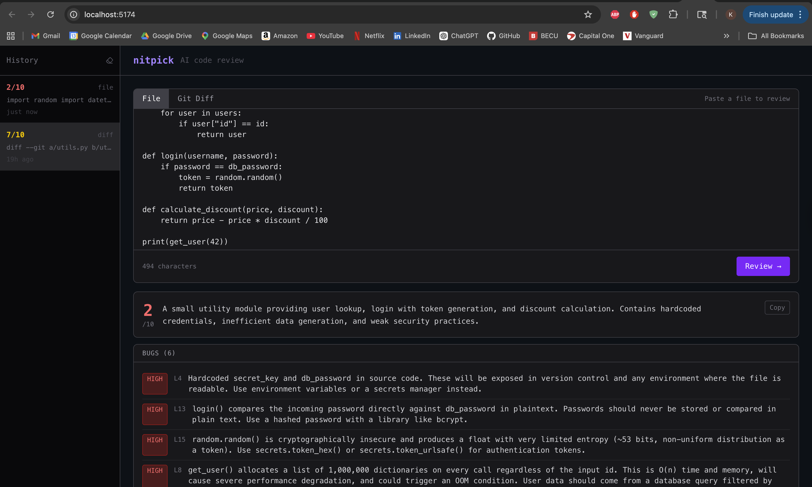

# nitpick

AI-powered code review in your terminal. Point it at a file or git diff and get structured feedback — bugs, style issues, and suggestions — from Claude in seconds.


---

## Features

- **Three input modes** — review a file, pipe a `git diff`, or auto-review staged changes
- **Structured output** — bugs ranked by severity (high / medium / low), style issues, suggestions, and a score out of 10
- **Pre-commit hook** — blocks commits automatically when high-severity bugs are found
- **GitHub Action** — posts a review as a PR comment on every pull request
- **React UI** — paste code into a browser interface and see the review rendered visually
- **Session history** — past reviews saved in localStorage, load any previous result instantly

---

## Architecture

```
┌─────────────────────────────────────────────────────┐
│                    nitpick                           │
│                                                     │
│  nitpick.py          server.py                      │
│  (CLI entry)         (FastAPI entry)                │
│       │                    │                        │
│       └────────┬───────────┘                        │
│                │                                    │
│         cli/reviewer.py        ◄── Claude API       │
│         cli/prompts.py                              │
│         cli/formatter.py                            │
│                                                     │
│  ui/  (React + Vite)  ──────► server.py :8000      │
└─────────────────────────────────────────────────────┘
```

**CLI path:** `nitpick.py` → `cli/main.py` reads input → `cli/reviewer.py` calls Claude → `cli/formatter.py` renders terminal output

**UI path:** React app on `:5173` → `POST /api/review` (Vite proxies to `:8000`) → `server.py` → same `cli/reviewer.py`

---

## Requirements

- Python 3.12+
- Node.js 18+
- An [Anthropic API key](https://console.anthropic.com)

---

## Installation

```bash
git clone https://github.com/kellybecker/nitpick.git
cd nitpick

# Python setup
python3.12 -m venv venv
venv/bin/pip install -r requirements.txt

# React UI setup
cd ui && npm install && cd ..
```

### API key

Create a `.env` file in the project root:

```
ANTHROPIC_API_KEY=your-key-here
```

For CLI use, export it in your shell instead:

```bash
export ANTHROPIC_API_KEY=your-key-here
```

---

## Usage

### CLI

```bash
# Review a file
venv/bin/python nitpick.py --file path/to/file.py

# Review a git diff (piped)
git diff | venv/bin/python nitpick.py --diff

# Review staged changes
venv/bin/python nitpick.py --staged

# Output GitHub-flavored markdown (used by the GitHub Action)
venv/bin/python nitpick.py --file path/to/file.py --markdown
```

### React UI

Start both servers:

```bash
# Terminal 1 — API server
venv/bin/uvicorn server:app --reload --port 8000

# Terminal 2 — React dev server
cd ui && npm run dev
```

Open [http://localhost:5173](http://localhost:5173), paste code or a git diff, and hit **Review**.



---

## Pre-commit Hook

Automatically reviews staged changes before every commit. Blocks the commit if high-severity bugs are found.

```bash
# Install
sh hooks/install.sh

# Bypass when needed
git commit --no-verify
```

The hook skips silently if `ANTHROPIC_API_KEY` is not set, so teammates without a key aren't blocked.

---

## GitHub Action

Add your API key as a repository secret (`Settings → Secrets → Actions`):

```
ANTHROPIC_API_KEY = your-key-here
```

The workflow (`.github/workflows/code-review.yml`) triggers automatically on every pull request, runs the diff through nitpick, and posts the review as a PR comment. The CI check turns red if high-severity bugs are found.

---

## Project Structure

```
nitpick/
├── cli/
│   ├── main.py          # CLI entry point (click)
│   ├── reviewer.py      # Claude API integration
│   ├── prompts.py       # System prompt and message builder
│   └── formatter.py     # Terminal (rich) and markdown output
├── ui/
│   └── src/
│       ├── App.tsx              # Root component, state, API call
│       ├── types.ts             # TypeScript interfaces
│       └── components/
│           ├── InputPanel.tsx   # Code textarea + mode toggle
│           ├── ResultsPanel.tsx # Review display
│           └── HistorySidebar.tsx
├── hooks/
│   ├── pre-commit       # Git hook script
│   └── install.sh       # Hook installer
├── .github/
│   └── workflows/
│       └── code-review.yml
├── nitpick.py           # CLI entry point
├── server.py            # FastAPI server
└── requirements.txt
```

---

## Tech Stack

| Layer | Tech |
|---|---|
| CLI | Python, Click, Rich |
| AI | Anthropic Claude (`claude-sonnet-4-6`) |
| API server | FastAPI, Uvicorn |
| Frontend | React, TypeScript, Vite, Tailwind CSS |
| CI | GitHub Actions |
